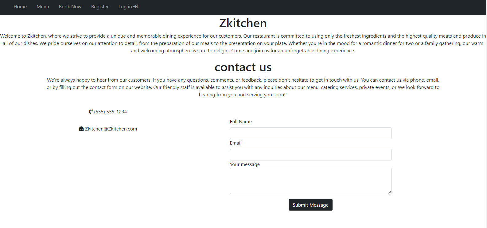
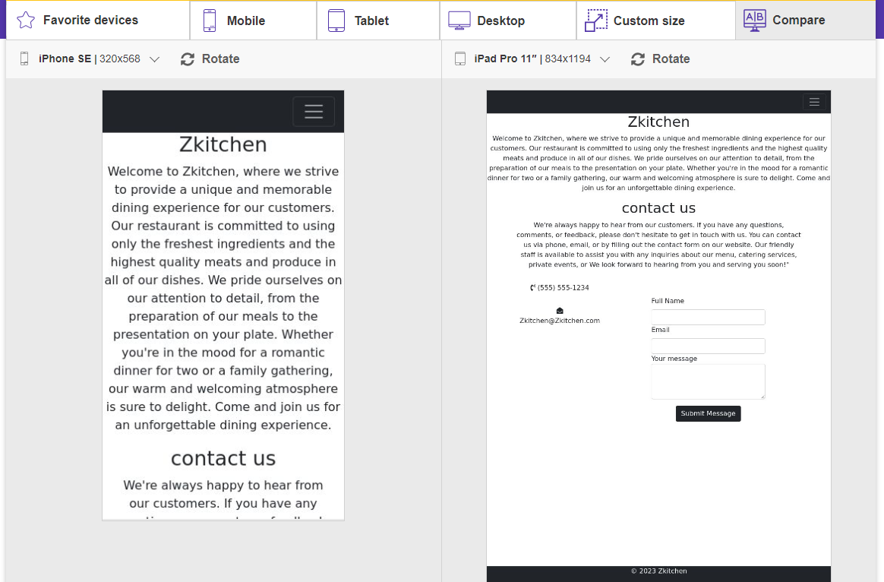
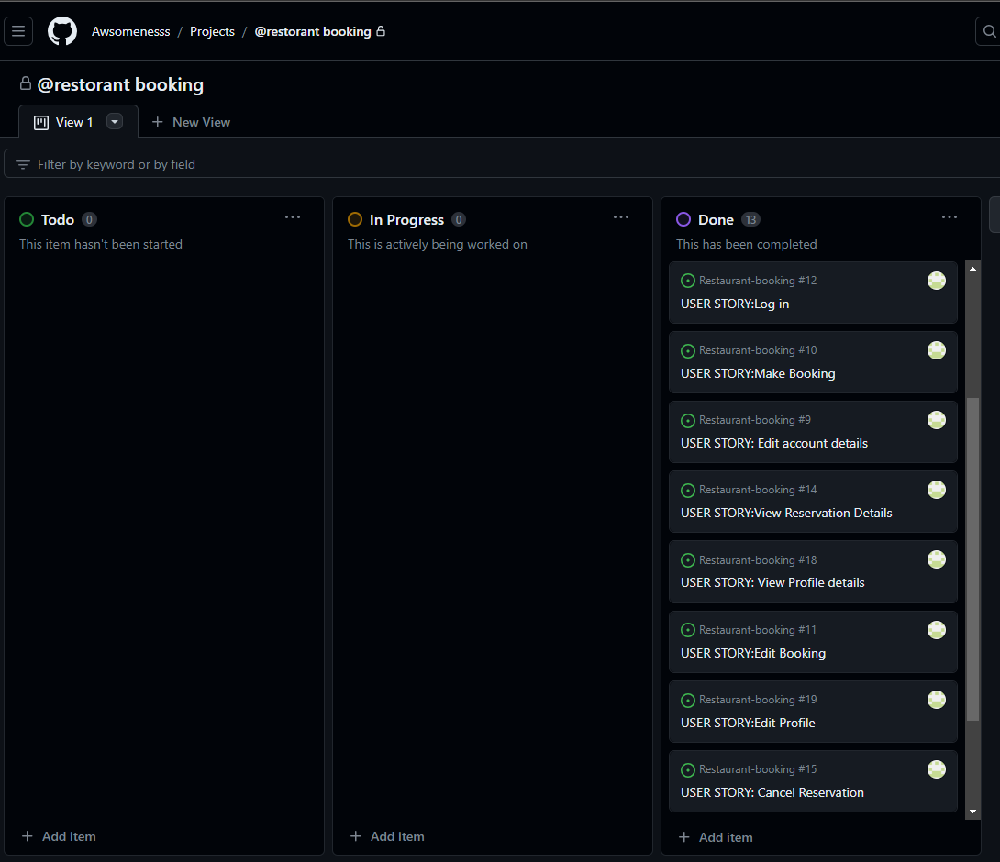
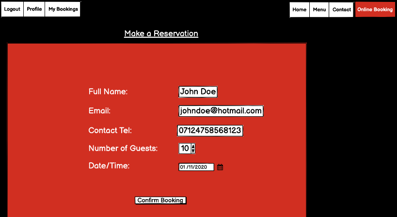
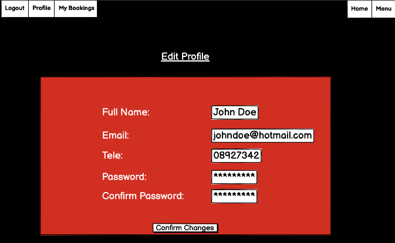

# Restaurant Booking System

## Introduction

This project is a simple restaurant booking system, that allows users to book a table for this restaurant. This will use languages such as Django, Python, HTML, CSS and JavaScript.
This project focuses on the use of CRUD functionality (Create, Read, Update, Delete). The user will be able to create, read, update, and delete their user profile and booking.

A live website can be found [here](https://restaurant-book.herokuapp.com/).





# Table of Contents

  1 [UX](#ux)
     *[Strategy](#strategy)
      *[Project Goals](#project-goals)
      *[User Goals:](#user-goals)
      *[Structure](#structure)
-   [2. Features](#features)
-   [3. Technologies Used](#technologies-used)
-   [4. Testing](#testing)
-   [5. Development Cycle](#development-cycle)
-   [6. Deployment](#deployment)
-   [7. End Product](#end-product)
-   [8. Known Bugs](#known-bugs)
-   [9. Credits](#credits)

<a name="ux"></a>
# 1. UX
The design emphasizes simplicity, efficiency, and accessibility for users. This includes easy table reservations, booking modifications, and cancellations. Users can create profiles update and delete effortlessly. For now, it is designed to demonstrate user-friendliness, user-centricity, and value delivery, with ongoing plans to enhance the overall user experience.

[Go to the top](#table-of-contents)

<a name="strategy"></a>
## Strategy

[Go to the top](#table-of-contents)

### Project Goals
The main goal of this project is to allow the user to sign up, sign in/out, create/update a user profile and create/update/delete a table booking in a simple and effective process.

### User Goals:
First Time Visitor Goals
-   As a first-time visitor, I want to book a table at my chosen date and time.
-   As a first-time visitor, I want to view the menu for the restaurant, so that I can see the book a table or not.
-   As a first-time visitor, I want to get the contact details of the restaurant with ease.

Returning Visitor Goals
-   As a Returning Visitor, I want to update my booking details.
-   As a Returning Visitor, I want to cancel a booking I have already made.
-   As a Returning Visitor, I want to edit my profile details for future bookings.

Frequent User Goals
-   As a Frequent User, I want to check to see if there are any new food items on the menu.

### User Expectations:
The system should have a simple user interface, with the navigation to each section clear and concise.

-   The menu is clear to read.
-   The user interface is easy to navigate.
-   The website is responsive on all devices.
-   To have the ability to contact the restaurant for any inquiries.

### User Stories
During the project, I used the GitHub Projects board as my project management tool.


##  Structure
-  Main Website
    * Home, Menu, Book Now, manage booking and profile.
    * Visually appealing, minimalistic and welcoming design.
    * All bookings are easily manageable for the user in the 'manage booking' page.
-  Admin dashboard
     * is a Django admin page now where site owner approves books awaiting approval. 

[Go to the top](#table-of-contents)

- Responsiveness across all device sizes.
- Intuitive navigation facilitated by clearly labeled buttons.
### Database Model
database structure:

```python
class Booking(models.Model):
    booking_id = models.UUIDField(
        primary_key=True, default=uuid.uuid4, editable=False)
    user = models.ForeignKey(
        User, on_delete=models.CASCADE, related_name="user_bookings")
    booking_date = models.DateField(auto_now=False)
    booking_time = models.TimeField(auto_now=False)
    booking_comments = models.TextField(max_length=200, blank=True)
    created_on = models.DateTimeField(auto_now_add=True)
    guest_count = models.IntegerField()
    status = models.IntegerField(choices=STATUS, default=0)

    class Meta:
        ordering = ['-booking_date']


class UserProfile(models.Model):
    user = models.OneToOneField(
        User, on_delete=models.CASCADE, primary_key=True)
    first_name = models.CharField(max_length=150)
    last_name = models.CharField(max_length=150)
    phone_number = models.CharField(max_length=11)

    def __str__(self):
        return str(self.user)
```
<a name="skeleton"></a>
## Skeleton

[Go to the top](#table-of-contents)

### wire-frames




# 2. Features

### Typography
    The font chosen was 'Montserrat' and I decided to use the standard 'sans-serif' font falls back to sans-serif if the 'Montserratd' font can't be loaded.

    * 'Montserrat' was chosen primarily to give a clear and familiar feeling to the website.

 * ### Colour Scheme
      The color scheme chosen is #f5f4f4 light gray color and #000000 pure black. This color scheme gives a minimalistic feeling to the website.<br /><br />


