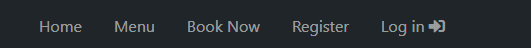
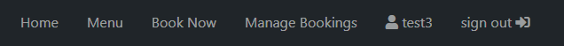
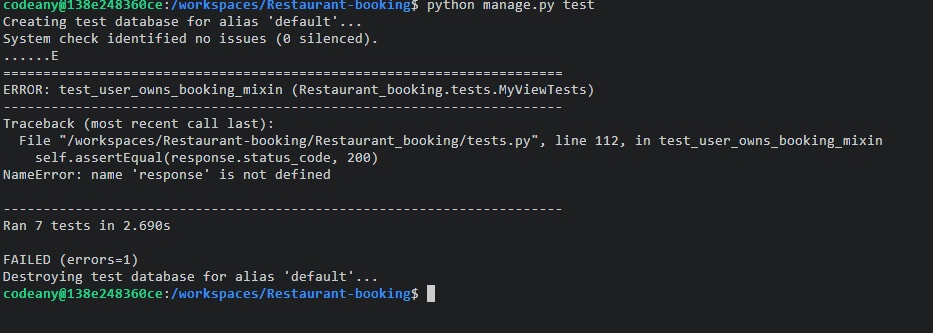

# Restaurant Booking System

## Introduction

This project is a simple restaurant booking system, that allows users to book a table for this restaurant. This will use languages such as Django, Python, HTML, CSS and JavaScript.
This project focuses on the use of CRUD functionality (Create, Read, Update, Delete). The user will be able to create, read, update, and delete their user profile and booking.

A live website can be found [here](https://restaurant-book.herokuapp.com/).


# Table of Contents

  1 [UX](#ux)
     *[Strategy](#strategy)
      *[Project Goals](#project-goals)
      *[User Goals:](#user-goals)
      *[Structure](#structure)
-   [2. Features](#features)
-   [3. Technologies Used](#technologies-used)
-   [4. Testing](#testing)
-   [5. Development Cycle](#development-cycle)
-   [6. Known Bugs](#known-bugs)
-   [7. Credits](#credits)

<a name="ux"></a>
# 1. UX
The design emphasizes simplicity, efficiency, and accessibility for users. This includes easy table reservations, booking modifications, and cancellations. Users can create profiles update and delete effortlessly. For now, it is designed to demonstrate user-friendliness, user-centricity, and value delivery, with ongoing plans to enhance the overall user experience.

[Go to the top](#table-of-contents)

<a name="strategy"></a>
## Strategy

[Go to the top](#table-of-contents)

### Project Goals
The main goal of this project is to allow the user to sign up, sign in/out, create/update a user profile and create/update/delete a table booking in a simple and effective process.

### User Goals:
First Time Visitor Goals
-   As a first-time visitor, I want to book a table at my chosen date and time.
-   As a first-time visitor, I want to view the menu for the restaurant, so that I can see the book a table or not.
-   As a first-time visitor, I want to get the contact details of the restaurant with ease.

Returning Visitor Goals
-   As a Returning Visitor, I want to update my booking details.
-   As a Returning Visitor, I want to cancel a booking I have already made.
-   As a Returning Visitor, I want to edit my profile details for future bookings.

Frequent User Goals
-   As a Frequent User, I want to check to see if there are any new food items on the menu.

### User Expectations:
The system should have a simple user interface, with the navigation to each section clear and concise.

-   The menu is clear to read.
-   The user interface is easy to navigate.
-   The website is responsive on all devices.
-   To have the ability to contact the restaurant for any inquiries.

### User Stories
During the project, I used the GitHub Projects board as my project management tool.


##  Structure
-  Main Website
    * Home, Menu, Book Now, manage booking and profile.
    * Visually appealing, minimalistic and welcoming design.
    * All bookings are easily manageable for the user in the 'manage booking' page.
-  Admin dashboard
     * is a Django admin page now where site owner approves books awaiting approval. 

[Go to the top](#table-of-contents)

- Responsiveness across all device sizes.
- Intuitive navigation facilitated by clearly labeled buttons.
### Database Model
database structure:

```python
class Booking(models.Model):
    booking_id = models.UUIDField(
        primary_key=True, default=uuid.uuid4, editable=False)
    user = models.ForeignKey(
        User, on_delete=models.CASCADE, related_name="user_bookings")
    booking_date = models.DateField(auto_now=False)
    booking_time = models.TimeField(auto_now=False)
    booking_comments = models.TextField(max_length=200, blank=True)
    created_on = models.DateTimeField(auto_now_add=True)
    guest_count = models.IntegerField()
    status = models.IntegerField(choices=STATUS, default=0)

    class Meta:
        ordering = ['-booking_date']


class UserProfile(models.Model):
    user = models.OneToOneField(
        User, on_delete=models.CASCADE, primary_key=True)
    first_name = models.CharField(max_length=150)
    last_name = models.CharField(max_length=150)
    phone_number = models.CharField(max_length=11)

    def __str__(self):
        return str(self.user)
```
<a name="skeleton"></a>
## Skeleton

[Go to the top](#table-of-contents)

### wire-frames


# 2. Features

### Typography
The font chosen was 'Montserrat' and I decided to use the standard 'sans-serif' font falls back to sans-serif if the 'Montserratd' font can't be loaded.
* 'Montserrat' was chosen primarily to give a clear and familiar feeling to the website.

### Colour Scheme
The color scheme chosen is #f5f4f4 light gray color and #000000 pure black. This color scheme gives a minimalistic feeling to the website.
### All Pages
- The navigation bar is placed at the top of all pages. The navigation bar is dynamic in that meaning depending on if the user is logged in or not the options will change.
- If the user is not logged in the navigation bar will look like this:
- 
- If the user is logged in the navigation bar will look like this:
- 
- The footer is placed at the bottom of each page with copyright 2023. When hovering over them it creates a brighter effect giving the user more of an experience. These icons will open the links in a new tab.

### Register Page
- A simple signup form that requires the user to enter a unique email address and a password. The password must be entered again for confirmation, this must match the already entered password above.
- A message to prompt the user that if an account is already been created they can click the sign-in hyperlink to be redirected to the sign-in page.
- If the user enters an email address that has already been registered, the user is prompted by an error message.
- If the user enters both passwords that do not match, the user is prompted

### Login Page
- A login form that requires the user to enter the email address and password that they used when signing up to the site.
- A message to prompt the user that if an account has not been created they can click the signup hyperlink to be redirected to the signup page.
- If the user enters wrong credentials, a message is displayed to the user.

### Logout Page
- When clicking logout from the navigation bar, the user is redirected to a sign-out page to confirm their action.

### Landing Page
- A book now button that directs the user to create a booking page. If the user has not logged in it will prompt the user to register or log in first.
- A short introduction to describe the restaurant.

### Profile Page
- Once the user has registered a profile will be created page. The page displays a form and details for the user to change their first name, last name and telephone number and user name and email they chose when signing in.

### Menu Page
- A menu that is displayed in 3 sections by the Meals.

### Home Page
- An information section that displays the restaurant's telephone number, email address.
- A contact form that requires the user to enter their full name, email address and a message. The form is already pre-filled with the user's full name it sendes masages to the code institute maildump  and redirects to the home page (if the user is logged in and has created a profile).

### Create Booking Page
- A form that requires the user to enter/select the booking details.
Full name and contact telephone number are prefilled if the user has created a profile.
The user will then need to select a date, time, number of guests and enter any allergy information if needed.
- When clicking the make reservation button the booking will then be requested to the restaurant owner for approval.

### Manage Booking Page
- Displays all user-related bookings in a list view within a card.
- Each card will show a booking reference, booking status, booking date, booking time, guest count. It will also contain a button to change booking details and a cancel booking button.

### Edit Booking Page
- This page will display the current booking details with a form below for the user to update any details.
- When the changes are submitted, the booking will be processed as the booking requested status.

### Cancel Booking
- When the user clicks the cancel booking button they will be redirected to a confirmation page.

<a name="technologies-used"></a>

## 3. Technologies Used

[Go to the top](#table-of-contents)

-   [HTML5](https://en.wikipedia.org/wiki/HTML)
    -   The project uses HyperText Markup Language.
-   [Python](https://en.wikipedia.org/wiki/Python_(programming_language))
    -   The project uses Python.
-   [Boostrap 4](https://getbootstrap.com/docs/4.0/getting-started/introduction/)
    -   The project uses Bootstrap 4.
-   [PostgreSQL](https://www.postgresql.org/)
    -   The project uses PostgreSQL as a database.
-   [codeanywhere](https://app.codeanywhere.com/)
    -   The project uses codeanywhere.
-   [Google Fonts](https://fonts.google.com/)
    -   Google fonts were used to import the "Montserrat" font into the style.css file which is used on all pages throughout the project.
-   [GitHub](https://github.com/)
    -   GitHub was used to store the project's code after being pushed from Git.
 
<a name="testing"></a>

# 4. Testing

[Go to the top](#table-of-contents)

* ## Code Validation

* The project has been validated by using online validation tools [W3C HTML Validator](https://validator.w3.org/)passes with few warnings,  [W3C CSS Validator](https://jigsaw.w3.org/css-validator/), [JSHint JavaScript Validator](https://jshint.com/) there is only one js function 


* ## Responsiveness Testing
    * I conducted responsive tests manually with [Google Chrome DevTools](https://developer.chrome.com/docs/devtools/).


* ## Automated Testing
    * During this project I have used  unit tests for a Django automated testing for my views. simulate HTTP requests, to check for expected behavior of my views application.
    * The tests check the behavior of of all the views to return HTTP status code of 200 (OK) except for the UserOwnsBookingMixin where users were able to access their own bookings 
      but passes during manual testing
    * To run the automated tests, type the command - ```python manage.py test```
 
      ```python

      ```

    


* ## Manual Testing
In addition to the other tests, I have conducted a manual checklist for myself to carry out to make sure that everything is working as intended.


| Status | **Main Website 
|:-------:|:--------|
| &check; | Clicking the  loads the home page
| &check; | Clicking the Home button on the nav bar loads the home page
| &check; | Clicking the Book Now button on the nav bar loads the login page
| &check; | Clicking the Account button on the nav bar shows the Register and Login dropdowns
| &check; | Clicking the Register button on the nav bar  loads the register page
| &check; | The user can register as a user and a profile is created on the register page
| &check; | Clicking the Login on the nav bar loads the login page
| &check; | registered user can log in on the login page
| &check; | Clicking the Book Now on the nav bar loads the login page
| &check; | The user can create a booking on the Book Now page
| &check; | Clicking the Manage booking on the nav bar loads the manage booking page
| &check; | The user can view booking on the Manage booking  page
| &check; | Clicking the change booking details on the  Manage booking  page loads edit booking page 
| &check; | The user can view and change booking details on the edit booking page 
| &check; | Clicking the cancel booking on the  Manage booking  page loads the delete booking page 
| &check; | Clicking the cancel booking on the delete booking page loads the manage booking page
| &check; | Clicking the yes on the delete booking page deletes the booking and loads the manage booking page
| &check; | Clicking the logged-in user account name and icon on the nav bar loads the profile page
| &check; | Clicking the update profile button after changes in the form profile details are updated 
| &check; | Clicking the sign out on the nav bar loads sign out page 
| &check; | sign out page signs out the logged-in user after they click sign out 

* ## Browser Compatibility
    * The website has had manual and responsive tests conducted on the below browsers with additional Lighthouse testing on Google Chrome and Microsoft Edge and I was presented with no issues.
        * Google Chrome
        * Microsoft Edge
        * Safari
        <br /><br />

# 5. Development Cycle

[Go to the top](#table-of-contents)

## Project Checklist
- Install Django and the supporting libraries
    -  Install Django and Gunicorn. Gunicorn is the server I am using to run Django on Heroku.
    - Install support libraries including psycopg2, this is used to connect the PostgreSQL database
    - Install Cloudinary libraries, this is a host provider service that stores images
    - Create the requirements.txt file. This includes the project's dependencies allowing us to run the project in Heroku.

- Create a new, blank Django Project
    - Create a new project
    - Create the app
    - Add restaurant_booking to the installed apps in settings.py
    - Migrate all new changes to the database
    - Run the server to test

- Setup project to use Cloudinary and PostgreSQL
    - Create new Heroku app
        - Sign into Heroku
        - Select New
        - Select create new app
        - Enter a relevant app name
        - Select appropriate region
        - Select the create app button

    - Attach PostgreSQL database
        - In Heroku go to resources
        - Search for Postgres in the add-ons box
        - Select Heroku Postgres
        - Submit order form

    - Prepare the environment and settings.py file
        - Create env.py file
        - Add DATABASE_URL with the Postgres URL from Heroku
        - Add SECRET_KEY with a randomly generated key
        - Add SECRET_KEY and generated key to the config vars in Heroku
        - Add if statement to settings.py to prevent the production server from erroring
        - Replace insecure key with the environment variable for the SECRET_KEY
        - Add Heroku database as the back end
        - Migrate changes to new database

    - Get static media files stored on Cloudinary
        - Create a Cloudinary account
        - From the dashboard, copy the API Environment variable
        - In the settings.py file create a new environment variable for CLOUDINARY_URL
        - Add the CLOUDINARY_URL variable to Heroku
        - Add a temporary config var for DISABLE_COLLECTSTATIC
        - In settings.py add Cloudinary as an installed app
        - Add static and media file variables
        - Add templates directory
        - Change DIR's key to point to TEMPALTES_DIR
        - Add Heroku hostname to allowed hosts
        - Create directories for media, static and templates in the project workspace
        - Create a Procfile

- Deploy new empty project to Heroku

<a name="deployment"></a>


# 6. Known Bugs

[Go to the top](#table-of-contents)

-  There is currently an issue with the `UserOwnsBookingMixin` that prevents it from working as expected in some scenarios. Specifically, when attempting to access a booking that does not exist, the mixin may raise an unexpected error.

- on the edit profile form successfully implemented a validation rule to ensure that users can only input numbers but have not succeded in setting min/max length in phone number input due to django-crispy-forms use.

<a name="credits"></a>
      
# 7.Acknowledgments
The site was completed as a part of a Full Stack Software Developer Diploma at the [Code Institute](https://codeinstitute.net/) and is my Portfolio Project 4. I would like to thank all at the Code Institute for their help and support.

<a name="credits"></a>
  
